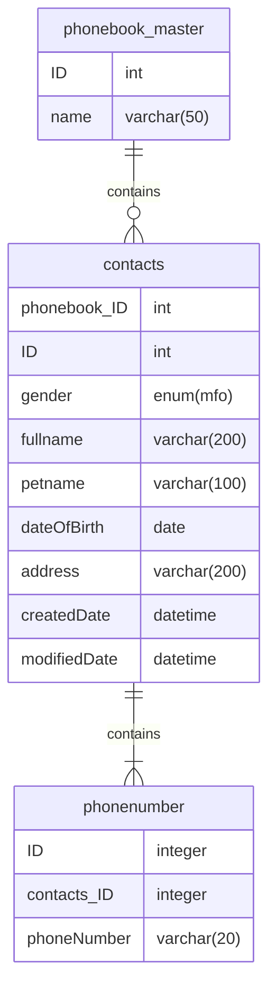

```mermaid
erDiagram
phonebook_master ||--o{ contacts : contains
phonebook_master {
    ID int
    name varchar(50)
}
contacts {
    phonebook_ID int
    ID int
    gender enum(mfo)
    fullname varchar(200)
    petname varchar(100)
    dateOfBirth date
    address varchar(200)
    createdDate datetime
    modifiedDate datetime
}
contacts ||--|{ phonenumber : contains

phonenumber {
    ID integer 
	contacts_ID integer	
	phoneNumber varchar(20)
}
```

