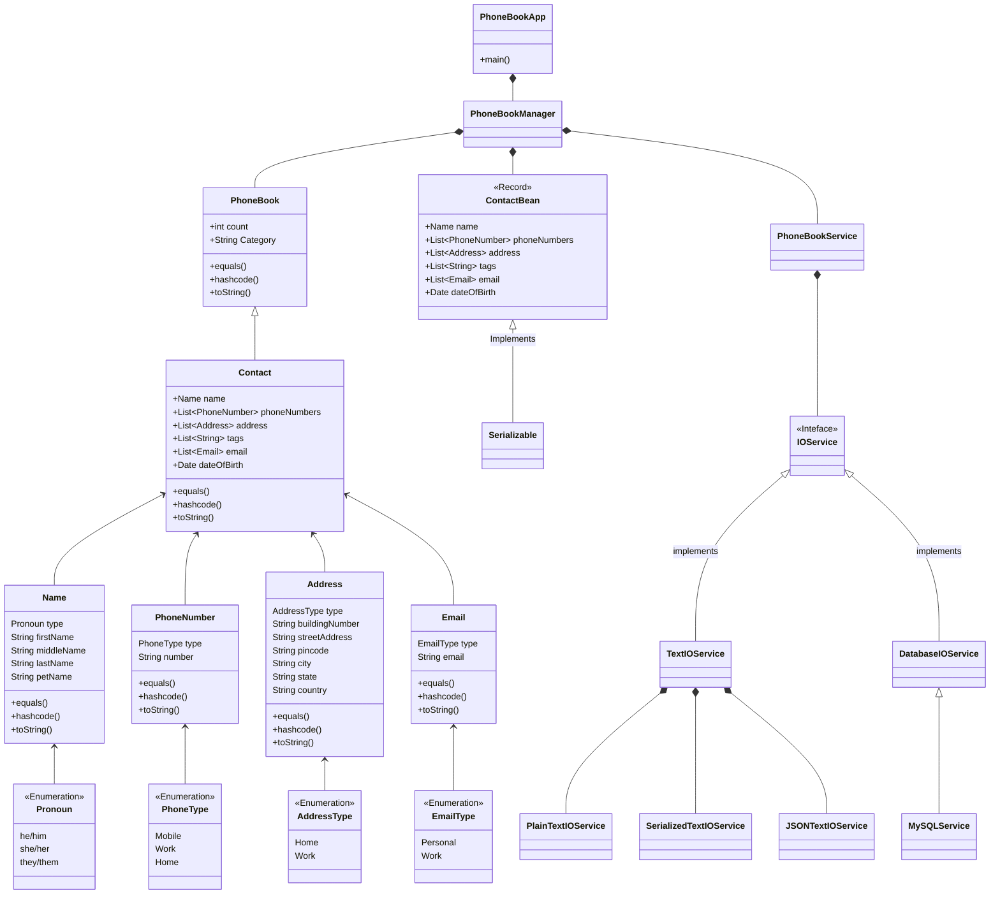

```mermaid
classDiagram
    PhoneBookApp 
    PhoneBookApp *-- PhoneBookManager
    PhoneBookManager *-- ContactBean
    PhoneBookManager *-- PhoneBook
    PhoneBookManager *-- PhoneBookService
    class PhoneBookService {

    }
    PhoneBookService *-- IOService
    class IOService {
        <<Inteface>>
    }
    IOService <|-- TextIOService : implements
    IOService <|-- DatabaseIOService : implements
    TextIOService *-- PlainTextIOService
    TextIOService *-- SerializedTextIOService
    TextIOService *-- JSONTextIOService
    DatabaseIOService <|-- MySQLService
    class TextIOService {

    }

    class DatabaseIOService {

    }

    class PlainTextIOService {

    }
    class SerializedTextIOService {

    }
    class JSONTextIOService {

    }
    class DatabaseIOService {

    }

    
    class PhoneBookApp {
        +main()
    }
    class ContactBean {
        <<Record>>
        +Name name
        +List~PhoneNumber~ phoneNumbers
        +List~Address~ address 
        +List~String~ tags 
        +List~Email~ email 
        +Date dateOfBirth
    }
    ContactBean <|-- Serializable : Implements
    PhoneBook <|-- Contact
    PhoneBook : +int count
    PhoneBook : +String Category
    PhoneBook: +equals()
    PhoneBook: +hashcode()
    PhoneBook: +toString()
 
    Contact <-- Name
    Contact <-- PhoneNumber
    Contact <-- Address
    Contact <-- Email
    class Contact{
        +Name name
        +List~PhoneNumber~ phoneNumbers
        +List~Address~ address 
        +List~String~ tags 
        +List~Email~ email 
        +Date dateOfBirth
        +equals()
        +hashcode()
        +toString()
    }
    class Name {
        Pronoun type
        String firstName
        String middleName
        String lastName
        String petName
        +equals()
        +hashcode()
        +toString()
    }
    Name <-- Pronoun
    class Pronoun {
        <<Enumeration>>
        he/him 
        she/her
        they/them
    }
    class PhoneNumber {
        PhoneType type
        String number
        +equals()
        +hashcode()
        +toString()
    }
    PhoneNumber <-- PhoneType
    class PhoneType {
        <<Enumeration>>
        Mobile
        Work
        Home
    }
    class Email {
        EmailType type
        String email
        +equals()
        +hashcode()
        +toString()
    }
    Email <-- EmailType
    class EmailType {
        <<Enumeration>>
        Personal
        Work
    }
    class Address{
        AddressType type
        String buildingNumber 
        String streetAddress 
        String pincode 
        String city 
        String state 
        String country 
        +equals()
        +hashcode()
        +toString()
    }
    Address <-- AddressType
    class AddressType {
        <<Enumeration>>
        Home
        Work
    }
```    