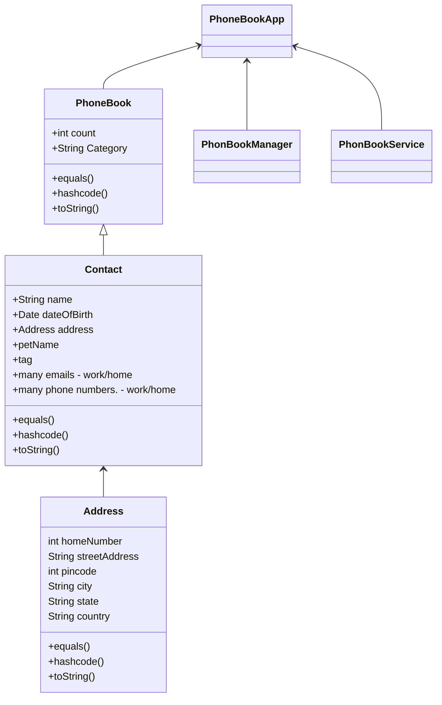

```mermaid
classDiagram
    PhoneBookApp <-- PhoneBook
    PhoneBookApp <-- PhonBookManager
    PhoneBookApp <-- PhonBookService


    PhoneBook <|-- Contact
    PhoneBook : +int count
    PhoneBook : +String Category
    PhoneBook: +equals()
    PhoneBook: +hashcode()
    PhoneBook: +toString()
 
    Contact <-- Address
    class Contact{
        +String name
        +Date dateOfBirth
        +Address address 
        +petName
        +tag 
        +many emails - work/home
        +many phone numbers. - work/home
        +equals()
        +hashcode()
        +toString()
    }
    class Address{
        int homeNumber 
        String streetAddress 
        int pincode 
        String city 
        String state 
        String country 
        +equals()
        +hashcode()
        +toString()
    }
```    