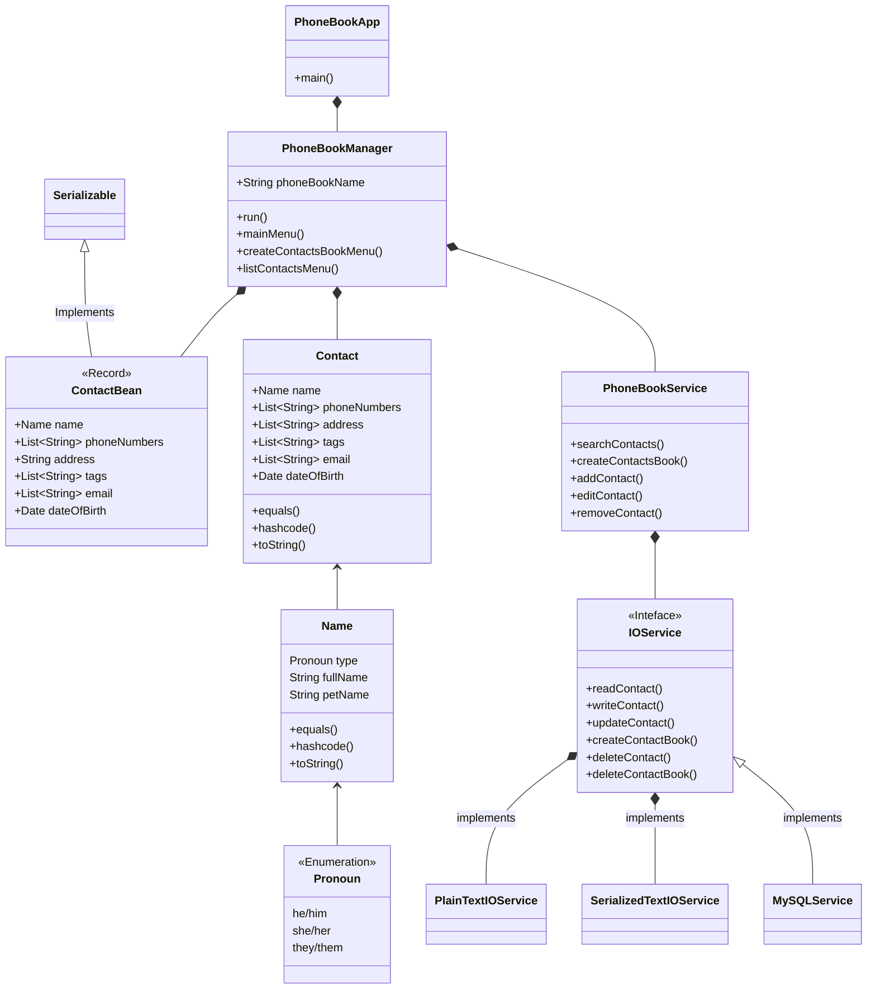

```mermaid
classDiagram
    PhoneBookApp 
    PhoneBookApp *-- PhoneBookManager
    PhoneBookManager *-- ContactBean
    PhoneBookManager *-- Contact
    PhoneBookManager *-- PhoneBookService
    class PhoneBookApp {
        +main()
    }
    class ContactBean {
        <<Record>>
        +Name name
        +List~String~ phoneNumbers
        +String address 
        +List~String~ tags 
        +List~String~ email 
        +Date dateOfBirth
    }
    class PhoneBookManager {
        +run()
        +mainMenu()
        +createContactsBookMenu()
        +listContactsMenu()
        +String phoneBookName
    }
    class PhoneBookService {
        +searchContacts()
        +createContactsBook()
        +addContact()
        +editContact()
        +removeContact() 
    }

    Serializable <|-- ContactBean: Implements
    Contact <-- Name
    class Contact{
        +Name name
        +List~String~ phoneNumbers
        +List~String~ address 
        +List~String~ tags 
        +List~String~ email 
        +Date dateOfBirth
        +equals()
        +hashcode()
        +toString()
    }
    class Name {
        Pronoun type
        String fullName
        String petName
        +equals()
        +hashcode()
        +toString()
    }
    Name <-- Pronoun
    class Pronoun {
        <<Enumeration>>
        he/him 
        she/her
        they/them
    }

        PhoneBookService *-- IOService
    class IOService {
        <<Inteface>>
        +readContact()
        +writeContact()
        +updateContact()
        +createContactBook()
        +deleteContact()
        +deleteContactBook()
    }

    IOService *-- PlainTextIOService : implements
    IOService *-- SerializedTextIOService : implements
    IOService <|-- MySQLService : implements

    class PlainTextIOService {

    }
    class SerializedTextIOService {

    }
    class MySQLService {

    }

```    