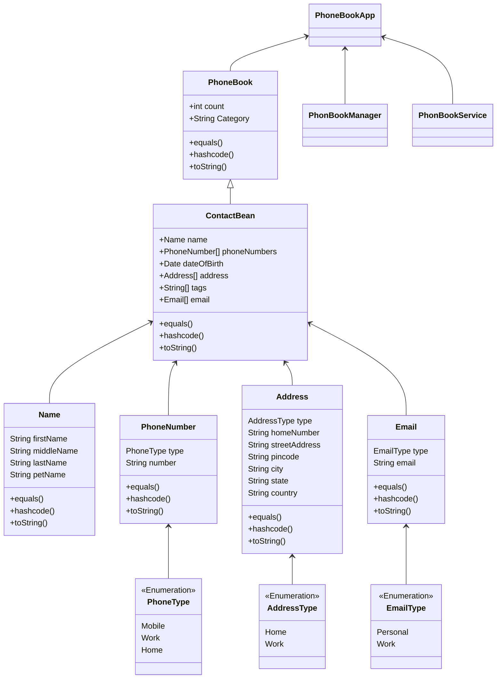

```mermaid
classDiagram
    PhoneBookApp <-- PhoneBook
    PhoneBookApp <-- PhonBookManager
    PhoneBookApp <-- PhonBookService


    PhoneBook <|-- ContactBean
    PhoneBook : +int count
    PhoneBook : +String Category
    PhoneBook: +equals()
    PhoneBook: +hashcode()
    PhoneBook: +toString()
 
    ContactBean <-- Name
    ContactBean <-- PhoneNumber
    ContactBean <-- Address
    ContactBean <-- Email
    class ContactBean{
        +Name name
        +PhoneNumber[] phoneNumbers
        +Date dateOfBirth
        +Address[] address 
        +String[] tags 
        +Email[] email 
        +equals()
        +hashcode()
        +toString()
    }
    class Name {
        String firstName
        String middleName
        String lastName
        String petName
        +equals()
        +hashcode()
        +toString()
    }
    class PhoneNumber {
        PhoneType type
        String number
        +equals()
        +hashcode()
        +toString()
    }
    PhoneNumber <-- PhoneType
    class PhoneType {
        <<Enumeration>>
        Mobile
        Work
        Home
    }
    class Email {
        EmailType type
        String email
        +equals()
        +hashcode()
        +toString()
    }
    Email <-- EmailType
    class EmailType {
        <<Enumeration>>
        Personal
        Work
    }
    class Address{
        AddressType type
        String homeNumber 
        String streetAddress 
        String pincode 
        String city 
        String state 
        String country 
        +equals()
        +hashcode()
        +toString()
    }
    Address <-- AddressType
    class AddressType {
        <<Enumeration>>
        Home
        Work
    }
```    